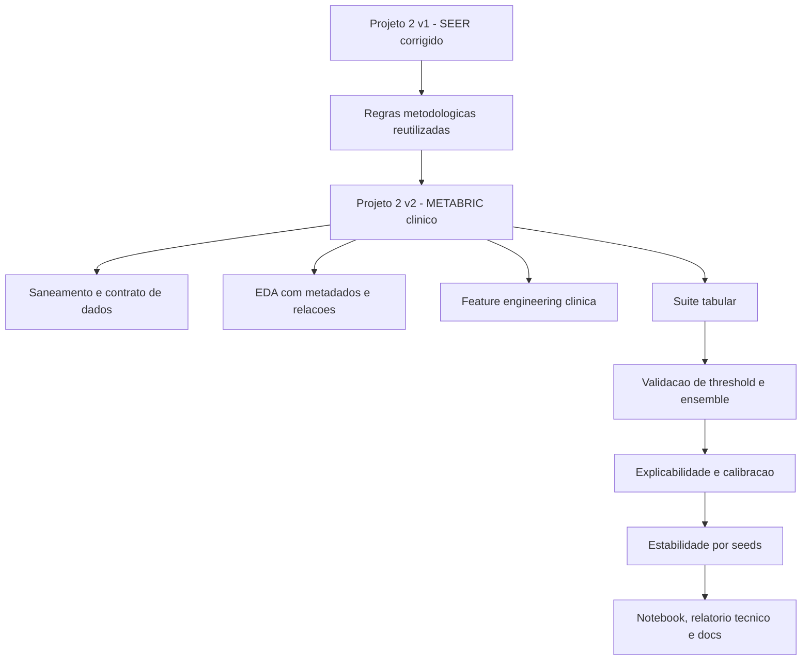

# Trabalho 2: Evolucao Clinica METABRIC do Projeto 2 - Design

**Spec**: `.specs/features/trabalho-2-breast-cancer-metabric/spec.md`  
**Status**: Executed

## Architecture Overview

A v2 nao substitui a v1; ela a encapsula como baseline historico e avanca a mesma arquitetura de pipeline para uma base mais rica.

## Key Design Decisions

| Decision | Choice | Rationale |
|---|---|---|
| Linha evolutiva | SEER v1 corrigido -> METABRIC v2 canonico | Preserva a historia tecnica e evita troca silenciosa de baseline. |
| Reuso de pipeline | Scripts `01..07` e pacote local espelhando a v1 | Garante comparabilidade metodologica real. |
| Critico de validacao | Threshold e pesos do ensemble na validacao | Remove o erro metodologico de usar o teste para tuning. |
| Artefato narrativo | Um notebook proprio por projeto | Mantem o padrao do repositorio e a defesa oral clara. |
| Auditoria de qualidade | Checklist de boas praticas em documento proprio | Separa completude metodologica de backlog futuro. |

## Components

### Feature TLC v2

- **Purpose**: Virar fonte canonica da evolucao METABRIC.
- **Location**: `.specs/features/trabalho-2-breast-cancer-metabric/`
- **Outputs**: `spec.md`, `design.md`, `tasks.md`, `relatorio_execucao.md`

### Pipeline METABRIC

- **Purpose**: Reproduzir a trilha completa com dataset clinico melhor.
- **Location**: `projeto_2_neuro_fuzzy_metabric_clinico/`
- **Main files**:
  - `01_validate_data.py`
  - `02_eda.py`
  - `03_train_models.py`
  - `04_threshold_and_ensemble.py`
  - `05_neuro_fuzzy_comparison.py`
  - `06_explainability.py`
  - `07_stability_analysis.py`
  - `run_pipeline.py`

### Documentation Layer

- **Purpose**: Manter a leitura executiva, a rastreabilidade e a ponte para relatorio historico.
- **Location**:
  - `STATUS.md`
  - `.specs/project/ROADMAP.md`
  - `.specs/project/STATE.md`
  - `.specs/project/TRABALHO_2_DATA_SCIENCE_BEST_PRACTICES_REVIEW.md`
  - `projeto_2_neuro_fuzzy_metabric_clinico/docs/PROJECT_EXECUTION_SUMMARY.md`

## Data Science Quality Gates

| Gate | Evidence |
|---|---|
| Contrato de dados | `01_validate_data.py`, `docs/DATA_DICTIONARY.md` |
| EDA orientada por metadados | `metadata_profile.csv`, `numeric_relationships.csv`, `categorical_relationships.csv` |
| Politica de vazamento | `features.py`, comparacao sem/com `survival_months` |
| Split sem contaminacao | `splits.py`, scripts `03` e `04` |
| Metricas clinicas | `evaluation.py`, tabelas de comparacao |
| Explicabilidade | `06_explainability.py`, coeficientes e permutation importance |
| Calibracao | `calibration_summary.csv`, `calibration_curves.csv` |
| Robustez | `07_stability_analysis.py`, `stability_summary.csv` |
| Reprodutibilidade | `run_pipeline.py`, `pytest`, `nbconvert` |

## Traceability Map

| Requirement | Components |
|---|---|
| BCM-01 | feature TLC v2, `ROADMAP.md`, `STATE.md`, `STATUS.md` |
| BCM-02 | pipeline METABRIC, testes, notebook, relatorio tecnico |
| BCM-03 | README METABRIC, relatorio tecnico METABRIC, relatorio execucao v2 |
| BCM-04 | review de boas praticas, docs de projeto, artefatos de validacao |
