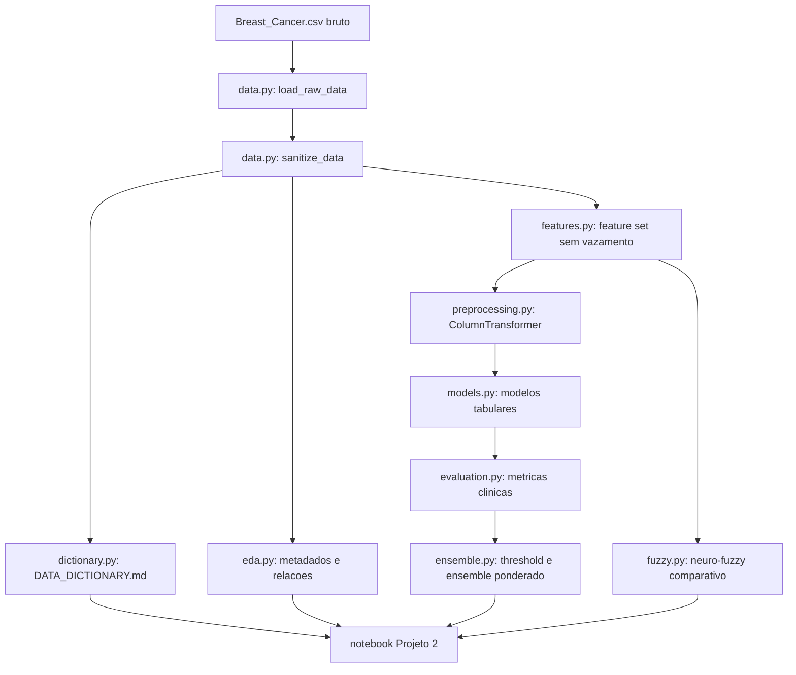

# Trabalho 2: Breast Cancer Survival Risk Design

**Spec**: `.specs/features/trabalho-2-breast-cancer/spec.md`  
**Status**: Executed

---

## Architecture Overview

O Projeto 2 sera reorganizado em um pipeline reprodutivel com funcoes compartilhadas e scripts numerados. Os scripts serao a fonte executavel; o notebook Jupyter sera a fonte narrativa e devera importar as mesmas funcoes para evitar divergencia.

## Code Reuse Analysis

### Existing Components to Leverage

| Component | Location | How to Use |
|---|---|---|
| Pipeline numerado | `01_check_data.py` a `05_neural_network_optimized.py` | Reusar convencao de scripts sequenciais, mas dentro de `projeto_2_neuro_fuzzy/`. |
| Notebook narrativo | `notebooks/trabalho_1_classificacao_saude_rf_vs_rn.ipynb` | Reusar padrao "um notebook consolidado por projeto". |
| Diagnostico de threshold | `scripts/diagnose_model_limits.py` | Reaproveitar ideia de threshold scan, PR AUC e permutation importance. |
| Docs vivos | `.specs/project/`, `.specs/codebase/` | Atualizar estado, roadmap, testing, structure e conventions. |
| Analise do audio | `projeto_2_neuro_fuzzy/analise_audio_estrategia.md` | Usar como justificativa metodologica para EDA, ensemble e foco em falsos negativos. |

### Integration Points

| System | Integration Method |
|---|---|
| Dataset local | `projeto_2_neuro_fuzzy/dataset/Breast_Cancer.csv` |
| Notebook | `projeto_2_neuro_fuzzy/notebooks/projeto_2_breast_cancer_survival.ipynb` importa pacote local. |
| Reports | `projeto_2_neuro_fuzzy/reports/figures/` e `projeto_2_neuro_fuzzy/reports/tables/`. |
| Docs tecnicos | `projeto_2_neuro_fuzzy/docs/DATA_DICTIONARY.md`. |
| Specs | `.specs/features/trabalho-2-breast-cancer/`. |

---

## Components

### Dataset Contract and Sanitization

- **Purpose**: Carregar CSV bruto, normalizar nomes/valores, mapear alvo e remover duplicatas.
- **Location**: `projeto_2_neuro_fuzzy/src/breast_cancer_survival/data.py`
- **Interfaces**:
  - `load_raw_data(path: Path = DATASET_PATH) -> pd.DataFrame`
  - `clean_column_name(name: str) -> str`
  - `sanitize_data(df: pd.DataFrame) -> pd.DataFrame`
  - `build_dataset_contract(raw: pd.DataFrame, clean: pd.DataFrame) -> pd.DataFrame`
- **Dependencies**: pandas, pathlib.
- **Reuses**: convencao de inspecao de `01_check_data.py`.

### Data Dictionary

- **Purpose**: Gerar e manter dicionario de dados com colunas brutas, sanitizadas, tipos, dominios, papel analitico, risco de vazamento e features derivadas.
- **Location**: `projeto_2_neuro_fuzzy/src/breast_cancer_survival/dictionary.py`
- **Interfaces**:
  - `build_data_dictionary(raw: pd.DataFrame, clean: pd.DataFrame) -> pd.DataFrame`
  - `write_data_dictionary(dictionary: pd.DataFrame, path: Path) -> None`
- **Dependencies**: pandas.
- **Reuses**: estrutura de `docs/DATA_DICTIONARY.md`, mas com escopo especifico do Projeto 2.

### Metadata and Relationship EDA

- **Purpose**: Produzir analise exploratoria com perfil de metadados, cardinalidade, distribuicoes, relacoes com `Status` e alerta de vazamento.
- **Location**: `projeto_2_neuro_fuzzy/src/breast_cancer_survival/eda.py`
- **Interfaces**:
  - `build_metadata_profile(raw: pd.DataFrame, clean: pd.DataFrame) -> pd.DataFrame`
  - `build_numeric_relationships(clean: pd.DataFrame) -> pd.DataFrame`
  - `build_categorical_relationships(clean: pd.DataFrame) -> pd.DataFrame`
  - `save_eda_outputs(clean: pd.DataFrame, raw: pd.DataFrame) -> None`
- **Dependencies**: pandas, numpy, scipy opcional, matplotlib, seaborn.
- **Reuses**: padrao de figuras de `02_eda.py`.

### Feature Policy and Engineering

- **Purpose**: Separar alvo/features, aplicar regra de exclusao de `Survival Months` e criar features clinicas defensaveis.
- **Location**: `projeto_2_neuro_fuzzy/src/breast_cancer_survival/features.py`
- **Interfaces**:
  - `split_features_target(df: pd.DataFrame, include_survival_months: bool = False) -> tuple[pd.DataFrame, pd.Series]`
  - `add_clinical_features(df: pd.DataFrame) -> pd.DataFrame`
- **Dependencies**: pandas.
- **Reuses**: decisoes de vazamento do spec.

### Model Training and Evaluation

- **Purpose**: Comparar modelos tabulares e calcular metricas adequadas ao problema medico.
- **Location**:
  - `projeto_2_neuro_fuzzy/src/breast_cancer_survival/preprocessing.py`
  - `projeto_2_neuro_fuzzy/src/breast_cancer_survival/models.py`
  - `projeto_2_neuro_fuzzy/src/breast_cancer_survival/evaluation.py`
- **Interfaces**:
  - `build_preprocessor(X: pd.DataFrame) -> ColumnTransformer`
  - `build_model_registry() -> dict[str, ClassifierMixin]`
  - `evaluate_predictions(y_true, y_prob, threshold: float = 0.5) -> dict`
  - `scan_thresholds(y_true, y_prob) -> pd.DataFrame`
- **Dependencies**: scikit-learn, pandas, numpy.
- **Reuses**: abordagem de `scripts/diagnose_model_limits.py`.

### Ensemble Ponderado

- **Purpose**: Combinar modelos tabulares usando pesos derivados de validacao e threshold otimizado, mantendo o teste intocado para reporte final.
- **Location**: `projeto_2_neuro_fuzzy/src/breast_cancer_survival/ensemble.py`
- **Interfaces**:
  - `normalize_weights(scores: dict[str, float]) -> dict[str, float]`
  - `weighted_average_probabilities(probabilities: dict[str, np.ndarray], weights: dict[str, float]) -> np.ndarray`
- **Dependencies**: numpy.
- **Reuses**: recomendacao do audio registrada em `analise_audio_estrategia.md`.

### Neuro-Fuzzy Comparativo

- **Purpose**: Manter componente hibrido como experimento academico justo, usando o mesmo dataset limpo e mesmas metricas.
- **Location**: `projeto_2_neuro_fuzzy/src/breast_cancer_survival/fuzzy.py`
- **Interfaces**:
  - `trimf(x, abc) -> np.ndarray`
  - `build_fuzzy_features(df: pd.DataFrame) -> pd.DataFrame`
- **Dependencies**: numpy, pandas, scikit-learn.
- **Reuses**: logica existente em `hybrid_neuro_fuzzy.py`, mas removendo duplicacao de limpeza e avaliacao.

### Notebook Narrativo

- **Purpose**: Consolidar narrativa e evidencias do Projeto 2 em artefato Jupyter.
- **Location**: `projeto_2_neuro_fuzzy/notebooks/projeto_2_breast_cancer_survival.ipynb`
- **Interfaces**:
  - Importa funcoes do pacote local.
  - Renderiza tabelas de `reports/tables`.
  - Inclui secoes: contexto, objetivo, dicionario, metadados, EDA, features, modelos, ensemble, neuro-fuzzy, conclusao.
- **Dependencies**: notebook/jupyter, pandas, matplotlib, seaborn.
- **Reuses**: padrao narrativo do notebook do Trabalho 1.

### Explicabilidade e Calibracao

- **Purpose**: Gerar explicabilidade global dos modelos lineares, permutation importance e analise basica de calibracao probabilistica para defesa oral.
- **Location**: `projeto_2_neuro_fuzzy/src/breast_cancer_survival/explainability.py`, `projeto_2_neuro_fuzzy/06_explainability.py`
- **Interfaces**:
  - `build_linear_coefficient_table(pipe, X_fit: pd.DataFrame) -> pd.DataFrame`
  - `build_permutation_importance_table(pipe, X: pd.DataFrame, y: pd.Series) -> pd.DataFrame`
  - `build_calibration_table(y_true, y_prob, model_name: str) -> pd.DataFrame`
- **Dependencies**: scikit-learn, pandas, matplotlib.
- **Reuses**: pipeline principal, metricas e ensemble corrigido.

### Estabilidade por Seeds

- **Purpose**: Gerar evidencia minima de robustez do baseline forte e do ensemble sem introduzir um framework pesado de validacao cruzada.
- **Location**: `projeto_2_neuro_fuzzy/07_stability_analysis.py`
- **Interfaces**:
  - `evaluate_seed(seed: int) -> list[dict]`
  - gera `stability_per_seed.csv` e `stability_summary.csv`
- **Dependencies**: pipeline principal, `splits.py`, `ensemble.py`, `evaluation.py`
- **Reuses**: mesma logica de validacao do ensemble do projeto principal.

---

## Data Models

### Raw Dataset

| Raw column | Sanitized column | Role |
|---|---|---|
| `Age` | `age` | Feature |
| `Race` | `race` | Feature |
| `Marital Status` | `marital_status` | Feature |
| `T Stage ` | `t_stage` | Feature |
| `N Stage` | `n_stage` | Feature |
| `6th Stage` | `6th_stage` | Feature |
| `differentiate` | `differentiate` | Feature |
| `Grade` | `grade` | Feature ordinal |
| `A Stage` | `a_stage` | Feature |
| `Tumor Size` | `tumor_size` | Feature |
| `Estrogen Status` | `estrogen_status` | Feature |
| `Progesterone Status` | `progesterone_status` | Feature |
| `Regional Node Examined` | `regional_node_examined` | Feature |
| `Reginol Node Positive` | `regional_node_positive` | Feature |
| `Survival Months` | `survival_months` | Excluded from main model; sensitivity/leakage analysis only |
| `Status` | `status` | Target: Alive=0, Dead=1 |

### Derived Features

| Feature | Formula | Rationale |
|---|---|---|
| `node_positive_ratio` | `regional_node_positive / regional_node_examined` clipped to 0-1 | Burden nodal relative to examined nodes. |
| `advanced_stage_flag` | `6th_stage in {IIIB, IIIC}` | Captures late stage grouping. |
| `hormone_receptor_negative` | ER negative OR PR negative | Captures hormone receptor risk signal. |
| `tumor_node_burden` | `tumor_size * (1 + node_positive_ratio)` | Combines tumor size and nodal positivity. |

### EDA Tables

| Output | Purpose |
|---|---|
| `metadata_profile.csv` | Schema, dtype, missing, unique count, examples, role, leakage flag. |
| `numeric_relationships.csv` | Numeric association with `status`, including `survival_months` warning. |
| `categorical_relationships.csv` | Target rate by category, support count, risk of sparse category. |
| `data_quality_summary.json` | Rows, columns, duplicates, missing, target distribution. |

---

## Error Handling Strategy

| Error Scenario | Handling | User Impact |
|---|---|---|
| Dataset path missing | Raise `FileNotFoundError` with expected path | Clear setup failure. |
| Unknown target value | Raise `ValueError` listing unexpected values | Prevent silent bad mapping. |
| Unknown `Grade` value | Raise `ValueError` listing unexpected values | Prevent broken ordinal mapping. |
| Zero `regional_node_examined` | Clip denominator lower bound to 1 and report anomaly | Feature remains finite. |
| Notebook cannot import package | Notebook prepends `projeto_2_neuro_fuzzy/src` to `sys.path` | Executable from repo root. |
| Model lacks `predict_proba` | Use calibrated wrapper or exclude from registry | Ensemble receives probabilities. |

---

## Tech Decisions

| Decision | Choice | Rationale |
|---|---|---|
| Source of truth | `.specs/features/trabalho-2-breast-cancer/` | TLC spec-driven flow requires traceable requirements, design and tasks. |
| Notebook location | `projeto_2_neuro_fuzzy/notebooks/` | Mantem um notebook por projeto e evita misturar com Trabalho 1. |
| `Survival Months` | Excluded from primary features | It is follow-up information and can leak outcome signal. |
| Metric priority | Falso negativo, recall, F2, PR AUC | Medical risk makes missing `Dead` cases more important than accuracy alone. |
| EDA scope | Metadata + relationships + figures | The missing EDA must explain schema and relationships before modeling. |
| Neuro-fuzzy role | Comparative academic model | Current implementation is not full ANFIS and underperformed clinically. |

---

## Traceability Map

| Requirement | Components |
|---|---|
| BC-01 | `features.py`, `03_train_models.py`, report, notebook |
| BC-02 | `data.py`, `01_validate_data.py`, tests |
| BC-03 | `dictionary.py`, `DATA_DICTIONARY.md`, notebook |
| BC-04 | `eda.py`, `02_eda.py`, reports/tables, reports/figures, notebook |
| BC-05 | notebook, `run_pipeline.py`, README |
| BC-06 | `models.py`, `evaluation.py`, `ensemble.py`, scripts 03/04 |
| BC-07 | `fuzzy.py`, script 05, report |
| BC-09 | `explainability.py`, script 06, report, notebook |
| BC-10 | `07_stability_analysis.py`, `stability_summary.csv`, report |
| BC-08 | `.specs/project/*`, `.specs/codebase/*`, `STATUS.md` |
