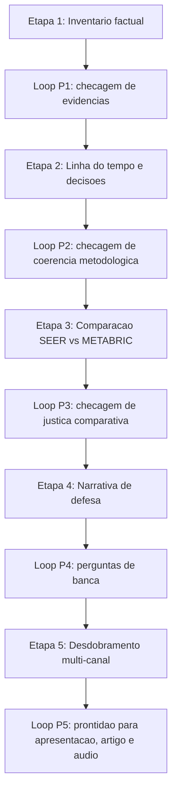

# Trabalho 2: Relatorio Historico Canonico - Design

**Spec**: `.specs/features/trabalho-2-relatorio-historico/spec.md`  
**Status**: Planned

## Architecture Overview

O relatorio historico sera construído como um pipeline documental em cinco etapas. Cada etapa termina com um **Loop de Revisao Professorial**, que funciona como gate de qualidade antes da etapa seguinte.

## Etapas do Processo

### Etapa 1: Inventario Factual

- reunir artefatos canonicos;
- reunir fontes de processo dos agentes;
- listar resultados validos;
- listar resultados historicos que nao podem mais ser vendidos como principais;
- mapear arquivos-fonte da narrativa.

**Loop Professorial P1**
- De onde veio cada numero?
- Essa afirmacao veio de artefato canonico ou de sessao de agente?
- Esse resultado foi medido em validacao ou teste?
- Existe algum numero repetido em docs com valor diferente?
- O que e fato executado e o que e interpretacao?

### Etapa 2: Linha do Tempo e Decisoes

- construir cronologia das mudancas;
- registrar por que o SEER foi corrigido;
- registrar por que o METABRIC entrou;
- separar decisao tecnica, achado empirico e backlog futuro.

**Loop Professorial P2**
- Qual foi o erro metodologico original?
- Em que momento ele foi corrigido?
- Por que a troca de dataset foi necessaria?
- O que mudou de pergunta cientifica e o que nao mudou?

### Etapa 3: Comparacao SEER vs METABRIC

- comparar escopo, variaveis, qualidade informacional e resultados;
- deixar claro que melhor dataset nao significa comparacao ingenua entre metricas;
- separar ganho por base de ganho por pipeline.

**Loop Professorial P3**
- A comparacao entre bases esta justa?
- O target e exatamente o mesmo conceito nas duas trilhas?
- O ganho veio do modelo ou da qualidade do dataset?
- Ha risco de parecer cherry-picking?

### Etapa 4: Narrativa de Defesa

- transformar os achados em tese defensavel;
- mapear trade-offs;
- estruturar respostas para perguntas provaveis de banca.

**Loop Professorial P4**
- Por que nao usar acuracia como metrica principal?
- Por que `survival_months` foi excluido?
- O neuro-fuzzy e ANFIS?
- Por que o ensemble com mais falsos positivos ainda pode ser valido?
- Quais sao as limitacoes que precisam ser assumidas sem maquiagem?

### Etapa 5: Desdobramento Multi-Canal

- preparar matriz de conteudo para slides;
- preparar esqueleto para artigo LaTeX;
- preparar roteiro-base para audio do grupo.

**Loop Professorial P5**
- O integrante que nao codou consegue explicar?
- O texto oral esta coerente com o tecnico?
- O artigo nao exagera conclusoes?
- O que deve ficar no corpo principal e o que vai para apendice?

## Output Artifacts

| Artifact | Purpose |
|---|---|
| `SOURCE_MAP.md` | Mapa oficial de fontes, hierarquia de autoridade e papel analitico |
| `relatorio_historico.md` | Fonte canônica da narrativa consolidada |
| `qa_professor_checkpoints.md` | Registro das perguntas criticas e respostas por etapa |
| `presentation_outline.md` | Estrutura de fala e slides |
| `latex_article_outline.md` | Estrutura-base do artigo |
| `audio_briefing_script.md` | Roteiro para repasse ao grupo |

## Source Hierarchy

| Tier | Source Type | Role | Authority |
|---|---|---|---|
| 1 | Artefatos do repositorio (`.specs`, `README`, `reports`, `notebooks`, CSVs) | Fonte canonica de entrega e resultado | Maxima |
| 2 | Sessoes de agentes (Codex e Antigravity) | Fonte de processo, racional, bifurcacoes e comandos orientadores | Complementar |
| 3 | Fontes interpretativas (audio, NotebookLM, notas) | Fonte de contexto, intencao e heuristica | Auxiliar |

## Agent Sessions to Include

| Agent | Session ID | Role in Analysis |
|---|---|---|
| Codex | `019f2525-5a79-7723-b4eb-8759cc32ce9f` | trilha principal do Projeto 2, audio, correcao metodologica, troca de dataset e formalizacao da v2 |
| Codex | `019f255f-88a8-7a81-b002-957841c02760` | trilha paralela de auditoria, Projeto 1, comparacao entre projetos e critica de boas praticas |
| Antigravity CLI | `cd405d9c-1645-4090-8ada-150e8f2aea59` | pesquisa inicial, analise de datasets, guia de acao, Projeto 1 e orientacao previa do processo |

## Quality Gates

| Gate | Pass Condition |
|---|---|
| Evidencia | Toda afirmacao relevante aponta para artefato executado |
| Hierarquia de fontes | Toda afirmacao baseada em sessao de agente esta marcada como fonte de processo, nao como verdade canonica isolada |
| Coerencia | Nao mistura baseline SEER com evolucao METABRIC |
| Metodologia | Explica vazamento, split, threshold e trade-offs corretamente |
| Defesa | Responde perguntas provaveis de banca sem depender de improviso |
| Reuso | O conteudo consegue ser reaproveitado em apresentacao, artigo e audio |
